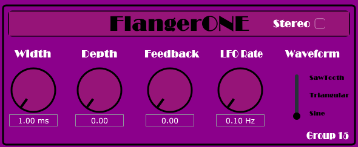

# FlangerONE

This folder contains all the source codes and build files of the audio plug-in FlangerONE.
It has been implemented by Group15 as the second homework for the course: Computer Music, Languages and Systems.

* **Builds Folder:**
	The "Builds" folder contains the exported build files for VST, VST3 and Standalone plugin standards.
* **JuceLibraryCode Folder:**
	The "JuceLibraryCode" folder contains all the needed JUCE libraries.
* **Source Folder:**
	The "Source" folder contains all the source files used.
* **JUCER file:**
	The .jucer file that can be opened in Projucer or Microsoft Visual Studio IDE.

The plugin can be opened within the most used DAWs, such as Cubase or Ableton.

Enjoy!

Group_15_CMLS
